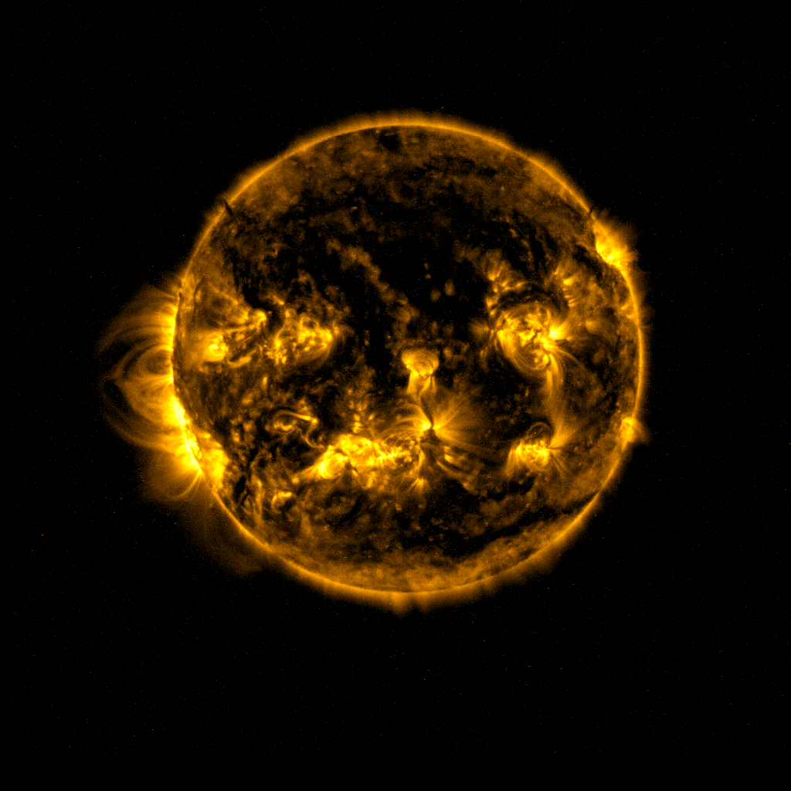

# Proba 2 Image Stabilizer and GIF Generator

This project uses several image processing techniques to stabilize and color raw imagery from ESA's PROBA-2 satellite. The data is obtained using SatDump.

Here is an example of the output of this application:

### Algorithm
1) Median blur to reduce noise for circle detection
2) Circle detection using Hough Circles
3) Move the center of the solar disk to the image center
4) Coarse alignment: Rotates the images by 90 degrees based on the first image it encounters.
5) Fine feature-based alignment.
6) Color with imagemagick (optional)

## Requirements
- Python 3 (Tested on python 3.13, should still work above 3.10)
- Required libraries in `requirements.txt` (`pip install -r requirements.txt` to install)
- Optional: ImageMagick for color

## How to run:
1) clone and navigate to the root of the git repository
2) Install the requirements mentioned above
3) Run main.py with the proper command line arguments

### Command line arguments:

1) Input path: `--in_path`, `-i` (required) — input folder containing PNG/JPG frames to process.
2) Output path: `--out_path`, `-o` — output folder for processed frames and the GIF (default computed as input path + _pro).
3) Extra rotation: `--extra_rotation`, `-r` (int, choices 0/1/2/3, default 0) — extra CCW rotation in 90° steps applied when generating rotated frames for the GIF.
4) Disable ImageMagick: `--no_magick` (flag) — disable ImageMagick usage; tinting and ImageMagick-based extra rotation will be skipped or fallback behavior used.

